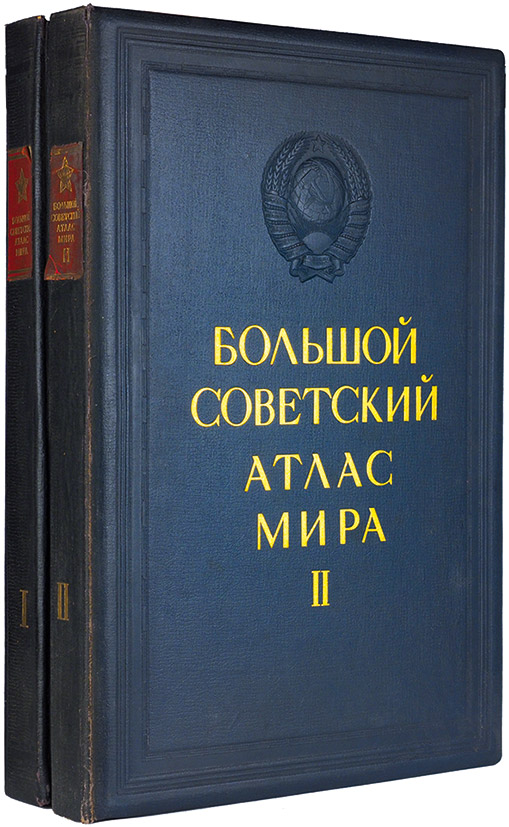
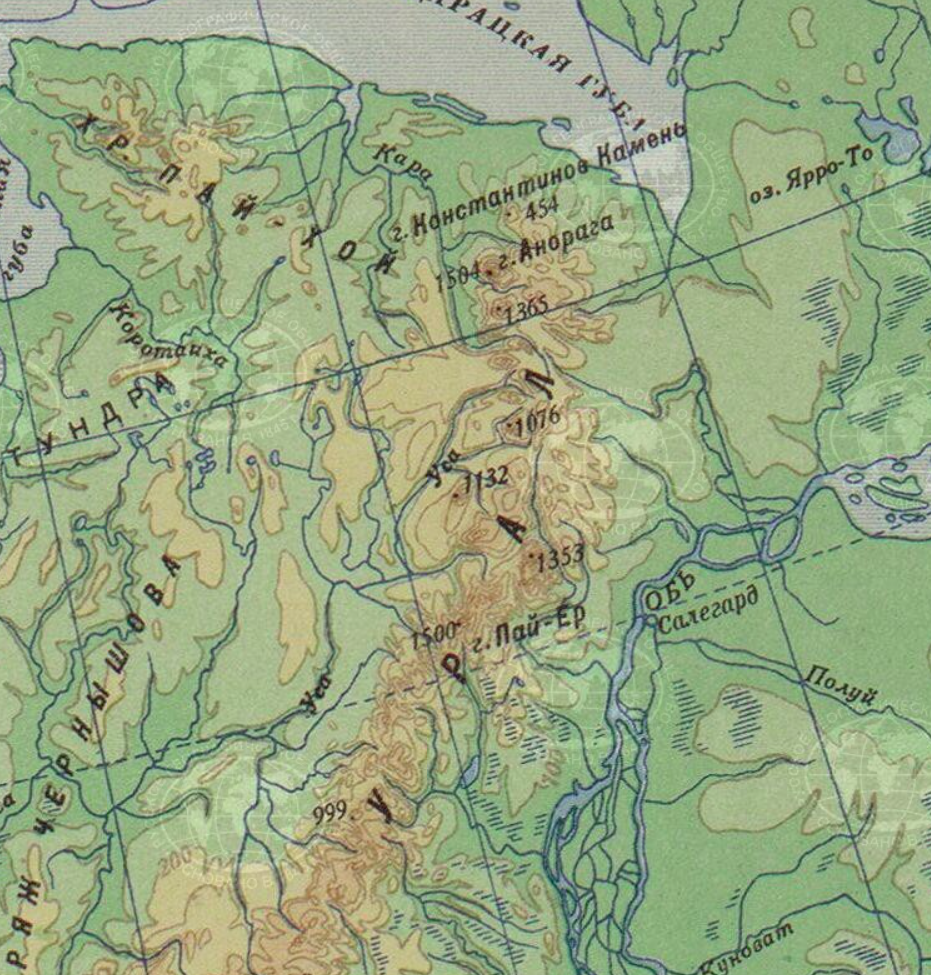
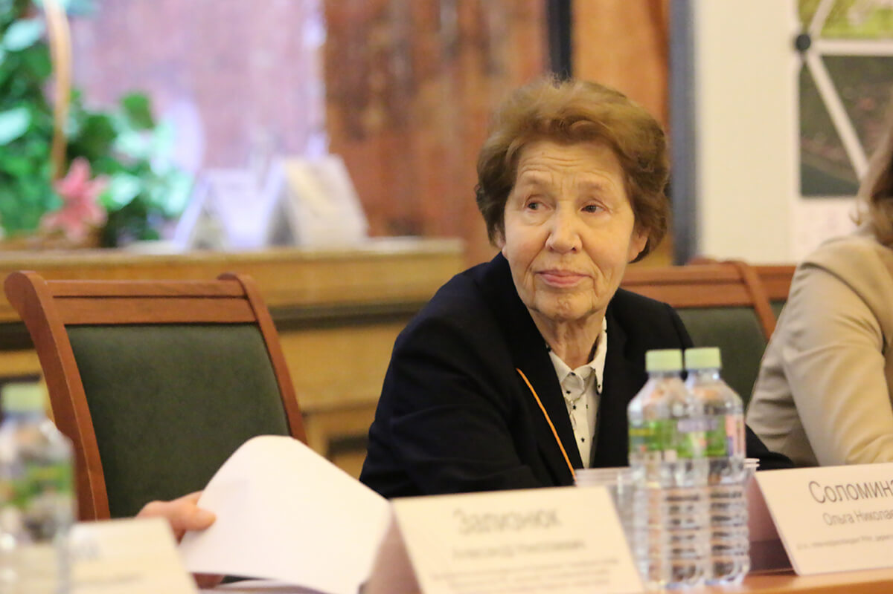

Кафедра зародилась в далеком **1929/1930** учебном году — в то время не существовало еще географического факультета, поэтому с уверенностью может называться одной из старейших его кафедр. Впрочем, в том далеком году появился лишь предок: особый учебный план на физико-математическом факультете, посвященный картографической специальности. Как бы это ни пугало студентов-первокурсников, картография в Московском Университете вышла именно из математики, единственная из ныне считающихся географическими специальностей. Инициатива создания специальности принадлежит выдающемуся географу, профессору А. А. Борзову. В этом деле активно участвовали профессора С. Г. Григорьев, М. С. Боднарский, В. М. Никифоров.

") 

Последний, **Владимир Михайлович Никифоров** стал первым заведующим кафедры, когда **25 октября 1932** года была образована **кафедра картографии и геодезии**. В прошлом Владимир Михайлович работал начальником картографического отделения военно-топографического отдела-штаба Красной Армии. Постоянными работниками кафедры кроме него были лишь ассистент Ф.Ф. Новиков, а позднее С. А. Херсонский, а приглашенными преподавателями — Н.Я. Бобир, Н. Ф. Булаевский, Г. Т. Иванищев, В. Н. Башлавин и молодые выпускники географического отделения Ю. В. Аристов и А. В. Гедымин. Профессор В.М. Никифоров за немногие годы работы сумел укрепить цикл картографических дисциплин на географическом отделении и факультете и положить начало созданию учебно-вспомогательной базы и кабинета. 

")

1 августа 1934 года заведующим кафедрой был назначен проф. **Владимир Александрович Каменецкий**, который в то время заведовал кафедрой составления и редакции карт в Московском геодезическом институте, а кроме того, работал консультантом в Научно-издательском институте Большого советского атласа мира, Центральном научно-исследовательском институте геодезии, аэросъемки и картографии и в других институтах.
В.А. Каменецкий уделял много внимания вопросам классификации картографических произведений, генерализации, анализу карт, истории карты. Его можно считать одним из первых создателей картоведения, разработчиком теоретических основ картографии. До сих пор заложенные им основы преподаются всему географическому факультету в курсах картографии и картоведения. 

")

В связи с тяжелой болезнью он оставил работу в 1936 г. и руководство кафедрой перешло к доценту **Петру Васильевичу Дензину** , который возглавлял ее до 1950 года. Он сосредоточил свои интересы на преподавании геодезии, создал классические учебники по этой дисциплине для географов. Картоведческое же направление развивал ученик В.А. Каменецкого — А.В. Гедымин, исследования которого по теории картографии и использованию карт во многом опередили свое время. В эти годы на кафедре преподавали такие известные ученые, как профессора Н.А. Урмаев и М.К. Вентцель, доценты Н.Я. Бобир, В.Н. Ченцов, А.В. Гедымин, преподаватели А.Ф. Мирошниченко, Л.А. Богомолов, Г.В. Господинов.

")

В 1936 после опубликования распоряжения Совнаркома РСФСР о подготовке специалистов-картографов набор студентов на картографическую специальность сильно увеличился, прием составил почти 60 человек. Для специальности картографии был создан особый учебный план, разработаны новые курсы по фотограмметрии и географическому дешифрированию аэрофотоснимков, экономико-географическому картографированию и др., расширилось приборное оснащение кафедры, была сформирована учебная картопечатная лаборатория. С 1940 г. на кафедре начались комплексные научно-исследовательские работы.

В первые несколько лет кафедра непосредственно причастна к составлению фундаментальных картографических трудов. Одной из главных работ является [Большой Советский Атлас Мира ](#) (БСАМ, 1937 — 1940) — крупная комплексная картографическая работа в двух томах. В атласе были применено большое число видов способов изображения, впервые в мировом атласном картографировании была использована единая гипсометрическая шкала высот для изображения рельефа. 

В 1950 г. кафедру возглавил профессор **[Константин Алексеевич Салищев](#)**, бывший тогда проректором МГУ. Он руководил кафедрой 37 лет и его деятельность составила целую эпоху. Кафедра превратилась в крупный учебный и научно-исследовательский центр, занявший передовые позиции в отечественной и мировой картографии. Были созданы Проблемная лаборатория комплексного картографирования и атласов, Лаборатория аэрокосмических методов и Лаборатория автоматизации в картографии. На кафедре были подготовлены доктора и кандидаты наук, на ней прошли стажировку многие специалисты высшей квалификации из нашей страны и зарубежных государств.

")

Работа лаборатории комплексного картографирования и факультета в целом в 1960-1970-е годы была направлена на составление региональных комплексных научных атласов регионов Союза ССР. За это время коллективом географов были выполнены работы по составлению атласов [Иркутской области](#) (1962), [Забайкальского края](#), [Тюменской области](#) (1971, 1976), [Северного Казахстана](#) и [Алтайского края](#) (1976, 1981). Впервые было проведено масштабное исследование административно-территориальных единиц такого уровня не только на инвентаризационном уровне, но и на оценочном и прогнозном.

На кафедре развернулись научные работы по сериям карт для высшей школы. Всего было выпущено две серии, первая из которых датирована серединой 1950-х годов. Такие карты отличаются содержанием пригодным как для обучения специалистов, так и для проведения научно-исследовательской работы. Авторы сохранили большую точность и детальность изображений, но при этом с "Камчатки" в аудитории можно все основные закономерности изображённой территории.

")

Большая заслуга в успехе этих работ принадлежит профессору И. П. Заруцкой, доцентам И. Н. Гусевой, О. А. Евтееву.

")

**Ирина Павловна Заруцкая** — советский учёный, картограф и геоморфолог. За создание гипосметрической карты масшаба 1:2 500 000 была удостоена Сталинской премии.

В те же годы кафедра стала центром Комиссии Национальных атласов Международного географического союза, председателем которой в 60-е годы был К. А. Салищев и штаб-квартирой Международной картографической ассоциации в период с 1972 по 1976 гг, когда заведующий кафедрой был избран Президентом МКА. Мощное развитие получили исследования по теории картографии, синтетическому картографированию, аэрокосмическим методам, картографическому методу исследования, математико-картографическому моделированию и другим научным направлениям. Это были годы становления школы географической картографии Московского университета. За это время, совпавшее с активным освоением космоса, невероятно мощное развитие получило дистанционное зондирование и смежные дисциплины.

В январе 1988 г. заведующим кафедрой был избран профессор **[Сергей Николаевич Сербенюк](#)**. Он руководил ею всего два года, но сыграл выдающуюся роль в повороте кафедры к автоматизации и геоинформационным технологиям. Именно в то время кафедра получила нынешнее название — картографии и геоинформатики. И дело не ограничилось переименованием, по сути, было положено начало глубокой переориентации высшего географо-картографического образования в Московском университете и других университетах России. С. Н. Сербенюк уделял много внимания теории и методам математико-картографического моделирования, был создателем первой автоматической картографической системы АКС-МГУ, возглавил работы по компьютеризации всего географического факультета. Благодаря ему ГИС-технологии стали неотъемлемой частью любой географической науки. С тех пор тесное взаимодействие картографии и геоинформатики остается генеральным направлением учебной и научной работы кафедры.

")

В 1990 году руководство кафедрой перешло к профессору **[Александру Михайловичу Бе́рлянту](#)**, который продолжил дело предшественника: активно внедрялись новейшие информационные технологии, разрабатывалось специальное программное обеспечение, использующееся до сих пор.

")

В наше время заведующий кафедры — доктор географических наук, профессор **[Ирина Константиновна Лурье](#)**. Она не оставила начатое С.Н Сербенюком и активно развитое А. М. Берлянтом дело. Сейчас кафедра продолжает внедрять самые современные технологии, совершенствует уже существующие и готовит ведущих специалистов в области картографии, геодезии, дешифрирования аэрокосмических снимков и геоинформационных технологий.

Сегодня кафедра признана в России лидирующей научной школой географической картографии.